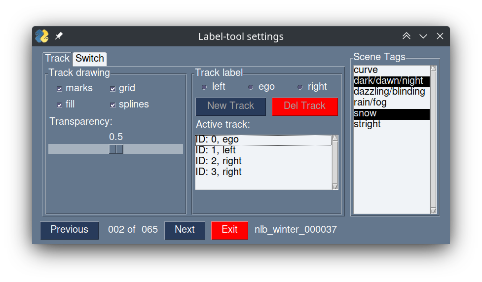
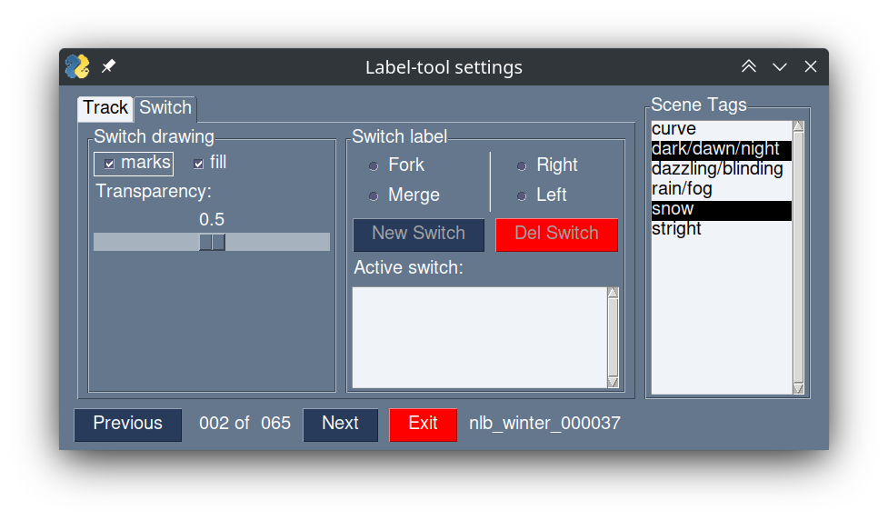
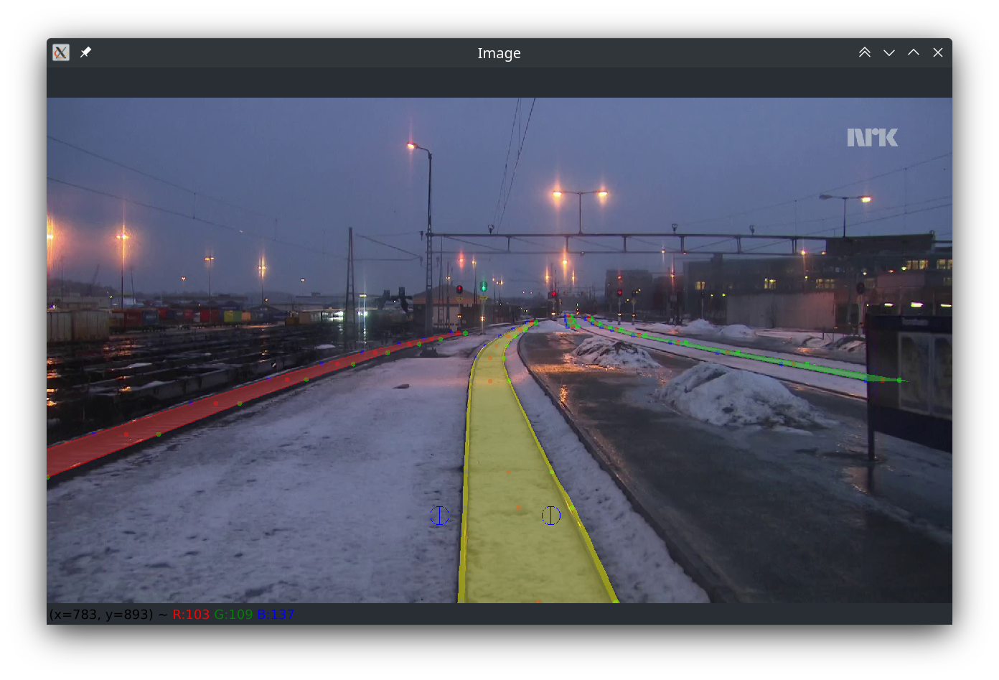

<div align="center">

</div>

## Installation
Label tool can be installed in multiple ways.
The preferred way is to install as python package.


### Install as python package on Windows(recommended)
0. Install Anaconda or Miniconda. Download here: https://docs.conda.io/projects/conda/en/latest/user-guide/install/windows.html
1. Start Anaconda Prompt
2. Create virtual environment with a python version 3.9:
```commandline
conda create --name <env_name> python=3.9
```
3. Activate virtual environment:
```commandline
conda activate <env_name>
```
4. Install the package`rail-label`. User wide installation with the `--user` flag  
```commandline
pip install git+https://gitlab.rz.htw-berlin.de/se_perception/raillabel.git
```
Optionally via ssh:
```commandline
pip install git+ssh://git@github.com/FloHofstetter/labeltool.git
```


### Install as python package on Linux(recommended)
You may install this package system-wide, user-wide or in a virtual environment.
0. If necessary, create and activate the environment. Minimum python version is 3.9.
```commandline
python3 -m venv venv
```
```commandline
source activate <environment name>/bin/activate
```
1. Install the package`rail-label`. User wide installation with the `--user` flag  
```commandline
pip install git+https://gitlab.rz.htw-berlin.de/se_perception/raillabel.git
```
Optionally via ssh:
```commandline
pip install git@gitlab.rz.htw-berlin.de:se_perception/raillabel.git
```

### Optional: Clone and launch manually
1. Clone this repository
```commandline
git clone https://gitlab.rz.htw-berlin.de/se_perception/raillabel.git
```
Optionally via ssh:
```commandline
git@gitlab.rz.htw-berlin.de:se_perception/raillabel.git
```
2. Create virtual environment and activate
```commandline
python3 -m venv venv
```
3. Install required packages
```commandline
pip install -r requirements.txt
```

## Application
<div id="container" style="white-space:nowrap">
    <div id="image" style="display:inline;">
        
    </div>
    <div id="texts" style="display:inline; white-space:nowrap;"> 
        
    </div>
    <div align="center">
        
    </div>
</div>

Describe Dataset. images must be in subfolder named 'image'. Do other folders (camera, annotations...) have to be there as well?
Provide path to a dataset on the ML-Server. Make sure, everyone has rights.

1. Change in the dataset directory
```commandline
cd ~/dataset
```
2. Start labeltool
```commandline
python3 -m rail_label
```
Optional start with dataset path as CLI argument:
```commandline
python3 -m rail_label --data_path <dataset path>
```

3. General:
    - Scenes are saved by clicking ether `Previous`, `Next` or `Exit`
    - Name of the scene is shown in the GUI
    - Files are iterated in alphabetical order
4. Mark Rails
   - Mark Rails [YouTube-Video](https://youtu.be/hgdwvG3IWCg):
     - Select the Scene you want to work on by clicking 
       `Next` or `Previous`
     - Select the Tab `Track` to get into the Switch-mode 
     - Select the attributes of the new rail (radio buttons)
     - Click `New Track` to create one
     - Select the track in the list
     - Focus the Image window and aim at te first mark and press `F`
     - Make as many marks as you need until you are satisfied with the result.
   - Correct Rail Mark [YouTube-Video](https://youtu.be/Frv2Oay0NMs):
     - Select the track in the list
     - Focus the Image window and aim roughly at the mark you
       want to correct
     - Press `R` to remove the mark
     - Aim and press `F` to set the corrected mark
   - Delete Track [YouTube-Video](https://youtu.be/hpP2G-qB0GE)
     - Select the track in the list
     - Push the `Del Track` button
5. Mark Switches   
    - Mark switches: [YouTube-Video](https://youtu.be/YMTCZgf2HCM)  
        - Select the Scene you want to work on by clicking 
        `Next` or `Previous`  
        - Select the Tab `Switch` to get into the Switch-mode  
        - Select the attributes of the new switch (radio buttons)   
        - Click `New switch` to create one
        - Select the switch in the list
        - Focus the Image window and aim at te first mark and press `F`
        - Aim at the second point and press `F`
    - Correct Mark / Delete Switches: 
      [YouTube-Video](https://youtu.be/MFqepueAOh0)
        - Select the switch in the list
        - Focus the Image window and aim roughly at the mark you
          want to correct
        - Press `R` to remove the mark
        - Aim and press `F` to set the corrected mark
        - Press `Delete Switch` to remove an entire switch
