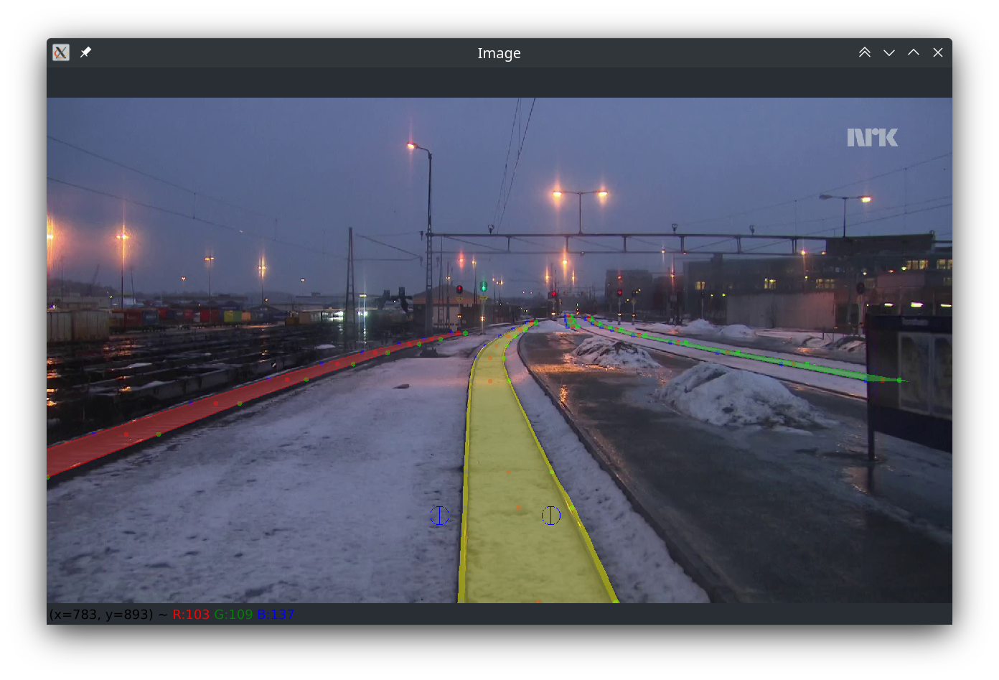
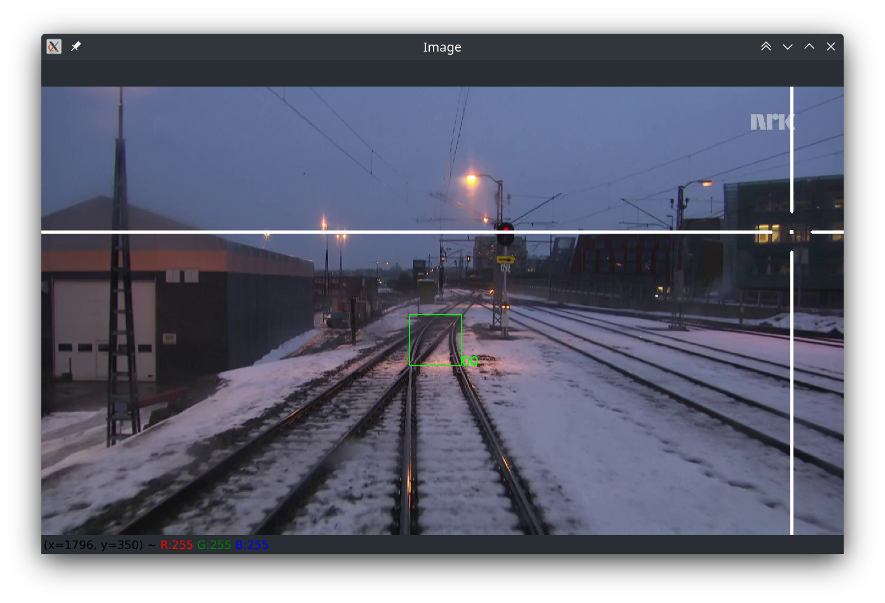

<div align="center">

</div>

[[_TOC_]]

# Installation

## Use case 1 - You want to use RailLabel with GUI to mark scenes:
You are a student or a member of the team, and you want to help to
extend our dataset by tagging images with the help of a GUI.

1. Python interpreter:  
    If you are experienced you can also install your packages via pip.
    But on Windows there is no QT version of OpenCV available and the
    function is limited. Linux works just fine with pip.
    If you are inexperienced just follow the instructions.
    - Install Miniconda (sufficient and small) or Anaconda:
      [Instructions](https://docs.conda.io/projects/conda/en/latest/user-guide/install/)
2. Clone this GIT-repository
   - `git clone git@gitlab.rz.htw-berlin.de:se_perception/raillabel.git`
   - OR: `git@gitlab.rz.htw-berlin.de:se_perception/raillabel.git`
3. Create, activate and install required packages into environment:
   - Open Terminal and chane directory to the repository root
   - `conda env update --file environment.yml --prune`
   - Activate conda environment: `conda activate RailLabel`
4. Launch the tool `python rail_label/__man__.py -d <path to dataset>`

## Use case 2 - You want to integrate RailLabel as a package
You are a student or team member, and you are building a neural
network or classical image processing algorithm, and you need labels
according to the YOLO scheme or segmentation masks.
This project should be integrated as a module in your project so
that you can generate your labels from the dataset.

1. TBD


## Install as python package on Linux(recommended)
You may install this package system-wide, user-wide or in a virtual environment.
0. If necessary, create and activate the environment. Minimum python version is 3.9.


# Expectations for the data structure
In order to work together efficiently, it is highly recommended to use the
proposed data structure as a working directory for the label tool:
```commandline
junk-root
├── annotations
│   ├── scene_000000.json
│   ├── scene_000001.json
│   ├── scene_.......json
│   └── scene_.....n.json
├── camera
│   └── camera.yaml
└── images
    ├── scene_000000.png
    ├── scene_000001.png
    ├── scene_.......png
    └── scene_.....n.png
```
- [mandatory] `junk-root` is the root directory to point RailLabel to 
- [mandatory] `camera/camera.yaml` contains the camera extrinsic
- [mandatory] `images` contains the images to mark on
- [generated] `annotations` contains information generated by RailLabel

# Application
Track tab                                    |  Switch Tab
:-------------------------------------------:|:---------------------------------------------:
     |  
  |  

1. General:
    - Check all `tags` which describe conditions on the scene.
      This independent of the current mode.
      [YouTube-Video](https://youtu.be/t0UTeER5TgE)
    - Scenes are saved by clicking ether `Previous`, `Next` or `Exit`
    - Name of the scene is shown in the GUI
    - Files are iterated in alphabetical order
3. Mark Rails
   - Mark Rails [YouTube-Video](https://youtu.be/hgdwvG3IWCg):
     - Select the Scene you want to work on by clicking 
       `Next` or `Previous`
     - Select the Tab `Track` to get into the Switch-mode 
     - Select the attributes of the new rail (radio buttons)
     - Click `New Track` to create one
     - Select the track in the list
     - Focus the Image window and aim at te first mark and press `F`
     - Make as many marks as you need until you are satisfied with the result.
   - Correct Rail Mark [YouTube-Video](https://youtu.be/Frv2Oay0NMs):
     - Select the track in the list
     - Focus the Image window and aim roughly at the mark you
       want to correct
     - Press `R` to remove the mark
     - Aim and press `F` to set the corrected mark
   - Delete Track [YouTube-Video](https://youtu.be/hpP2G-qB0GE)
     - Select the track in the list
     - Push the `Del Track` button
4. Mark Switches   
    - Mark switches: [YouTube-Video](https://youtu.be/YMTCZgf2HCM)  
        - Select the Scene you want to work on by clicking 
        `Next` or `Previous`  
        - Select the Tab `Switch` to get into the Switch-mode  
        - Select the attributes of the new switch (radio buttons)   
        - Click `New switch` to create one
        - Select the switch in the list
        - Focus the Image window and aim at te first mark and press `F`
        - Aim at the second point and press `F`
    - Correct Mark / Delete Switches: 
      [YouTube-Video](https://youtu.be/MFqepueAOh0)
        - Select the switch in the list
        - Focus the Image window and aim roughly at the mark you
          want to correct
        - Press `R` to remove the mark
        - Aim and press `F` to set the corrected mark
        - Press `Delete Switch` to remove an entire switch
